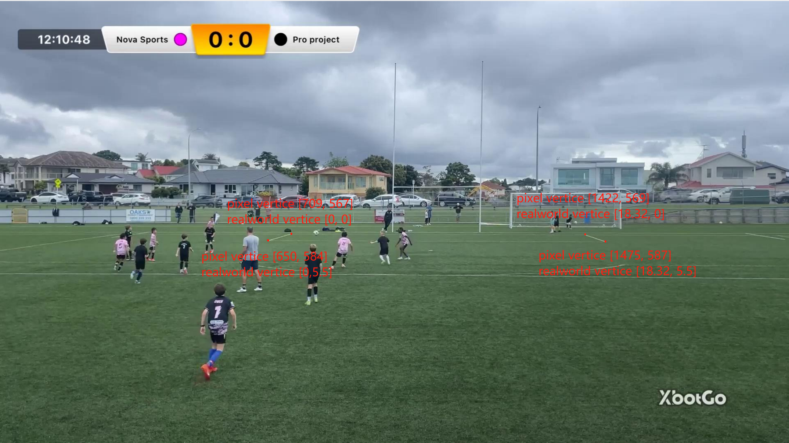

# Football Matach Analysis Project

## Introduction

This project aims to detect and track players, referees, and the football in videos, while also calculating the ball possession rate of both teams. Afterward, through perspective transformation, it determines their actual speed and movement distance. For the identification of individuals on the field and the football, I use the YOLO model, which offers core advantages in efficiency and real-time processing while maintaining high detection accuracy.

## Requirements

To run this project, you need to have the following requirements installed:

- Python 3.8
- ultralytics
- supervision
- OpenCV
- NumPy
- Matplotlib
- Pandas

## Project Structure

- `camera_movement_estimator`: This folder is used to estimate the displacement caused by camera movement for compensation using the optical flow method, a traditional yet practical approach.
- `input_videos`: This folder is used to store the videos that need to be detected. The specific path can be adjusted in `main.py`.
- `models`: This folder contains the trained models. You need to download them and place them in this folder. The download link is: [xxxx](#).
- `output_videos`: This folder contains the final generated videos, including annotated personnel and their real-time speed and ball possession rate.
- `player_ball_assigner`: This module is used to assign ball possession. The core logic is to determine which team the player closest to the football in this frame belongs to.
- `speed_and_distance_estimator`: This module calculates the running distance and real-time speed.
- `stubs`: This folder stores previously run data to avoid repeated execution. This is not mandatory.
- `team_assigner`: This module assigns players to teams. It first takes the upper part of the bounding box detected by YOLO to avoid color recognition interference from pants, then determines the team based on the color of the jersey. A special case is the goalkeeper, who may not wear the same color as other players on the team. In such cases, the team is assigned based on the goalkeeper's ID.s
- `trackers`: This module uses YOLO for object detection. Subsequent image post-processing, including marking players and displaying ball possession rates on the video, is done here.
- `view_transformer`: This module performs perspective transformation. It calculates the transformation matrix using the pixel coordinates of the four standard penalty areas in a frame with a regular focal length (the focal length used most frequently in the video) and their actual coordinates. Since the focal length changes little throughout the video, its impact is ignored.


## Usage

1. Clone the repository:
   ```bash
   git clone xxx
   cd
   ```

2. Install the required packages:

3. Download the trained models and place them in the `models` folder. The download link is: [xxxx](to be updated).

4. Place the input videos in the `input_videos` folder.
sample video: https://www.youtube.com/watch?v=CUlWbRMsb1U&t=1210s

5. Run the main script:
   ```bash
   python main.py
   ```

## Acknowledgements

This algorithm is inspired by [Abdullah Tarek](https://github.com/abdullahtarek)'s work on tracking football matches.
